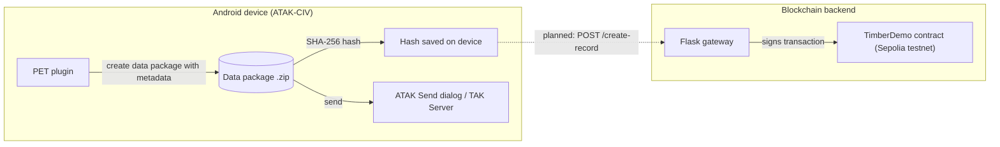

# PET — Provable Evidence Tracing

PET is an ATAK/CivTAK plugin and blockchain backend for recording forestry supply-chain events as tamper-evident evidence. Field users package data on an Android device running ATAK, and PET fingerprints each package with a SHA-256 hash. The goal is to anchor those hashes on a blockchain, so anyone can later check that a record hasn't been altered and trace its chain of custody (for example, logger → trucker → processor).

PET is developed by the [Dynamic Sustainability Lab (DSL)](#authors) at Syracuse University as part of the USDA AMP Blockchain project.

> **Status: research prototype.** The plugin and the blockchain backend both run, but **they are not yet connected**, so hashes created by the plugin are not written on-chain automatically. The backend targets the Ethereum **Sepolia testnet** only. See [Known limitations](#known-limitations).

---

## Background

<!-- TODO: 2–3 sentences on the USDA AMP program and how PET supports its objective. -->
_TODO: Describe the USDA AMP objective and how PET contributes to it._

Timber moves through many hands between harvest and processing, and each handoff is a chance for records to be lost, disputed, or altered. PET is designed to:

1. Capture evidence where the event happens, on an Android device running ATAK.
2. Hash that evidence, so any later change to the file produces a different fingerprint.
3. Record the hash on a public blockchain with a timestamp, and let each supply-chain role add a verification entry.

The goal is a chain of custody that no single party can quietly rewrite. The current prototype doesn't reach that yet: the plugin and the blockchain aren't connected, one wallet signs every transaction, and the contract has no access control. See [Known limitations](#known-limitations).

## How it works



| Step | Component | Status |
|---|---|---|
| Enter package metadata (name, description, author, lat/lon pre-filled from map center) | Plugin | Working |
| Build an ATAK data package containing that metadata | Plugin | Working |
| Compute a SHA-256 hash of a selected data package and store it on the device | Plugin | Working |
| Send the package through ATAK's standard Send dialog | Plugin | Working |
| Record a hash on-chain and return a record ID | Gateway + contract | Working (called directly, not from the plugin) |
| Add role-based verifications (`logger`, `trucker`, `processor`) and read chain-of-custody history | Gateway + contract | Working (called directly) |
| Plugin sends its hash to the gateway automatically | Plugin → Gateway | **Planned** |

## Repository layout

```
PET/
├── lingualinkledger/   ATAK-CIV plugin (Android / Java / Gradle)
│   └── README.md       Build and install instructions
├── witec-demo/         Smart contract, Flask gateway, and deployment scripts
│   └── README.md       Deploy and run instructions
├── SECURITY.md         Security model and known issues
├── CONTRIBUTING.md     How to contribute
└── README.md           This file
```

## Getting started

Each component builds and runs independently. Start with the one you need.

**Plugin** ([`lingualinkledger/README.md`](lingualinkledger/README.md)): requires the [ATAK-CIV SDK](https://github.com/TAK-Product-Center/atak-civ/releases), Android Studio, JDK 17, and an Android device with ATAK-CIV installed. Targets ATAK 5.4.0.

> **Where to put the repo:** clone PET directly into the root of the extracted SDK, as `atak-civ-sdk/PET/`. The plugin build looks for `atak-gradle-takdev.jar` two folders above `lingualinkledger/`, and this location puts it there. To keep the repo somewhere else, set `takdev.plugin=<path to atak-gradle-takdev.jar>` in `lingualinkledger/local.properties`. Details are in the plugin README.

**Blockchain backend** ([`witec-demo/README.md`](witec-demo/README.md)): requires Node.js and npm (Hardhat), Python 3 (Flask, web3.py), a Sepolia RPC endpoint (the gateway's gas-price lookup expects an Infura URL), and a funded Sepolia wallet. The reference deployment runs on an Ubuntu 22.04 Azure VM behind nginx.

## Tech stack

| Component | Technologies |
|---|---|
| Plugin | Java, Android (min SDK 21, target SDK 33), ATAK-CIV plugin API, Gradle 8.9 |
| Smart contract | Solidity 0.8.28, Hardhat 2.x, Ethereum Sepolia |
| Gateway | Python, Flask, web3.py, nginx, systemd |

## Component names

This repository combines two earlier repositories. Each one keeps its original name as its folder, and the code still uses those names:

| Folder | Component | Where the name appears in the code |
|---|---|---|
| `lingualinkledger/` | PET plugin (app name **Lingua Link Ledger**) | Java package `com.atakmap.android.lingualinkledger`, app name, on-device folder `atak/tools/lingualinkledger/` |
| `witec-demo/` | PET blockchain backend | VM and service names, domain `witec.io`. The contract is named `TimberDemo` |

## Known limitations

PET is a testnet prototype. The most important limitations:

- **No authentication on the gateway.** Anyone who can reach it can create, verify, or deactivate records, and every call spends the gateway wallet's funds.
- **A single wallet signs every transaction.** On-chain, the creator and verifier addresses are the gateway's, not the individual field user's.
- **No access control in the contract.** Any caller can deactivate records or add new roles.
- **The plugin is not yet connected to the blockchain** (see [Status](#how-it-works)).

See [`SECURITY.md`](SECURITY.md) for details and reporting instructions.

## Contributing

Contributions are welcome. Please read [`CONTRIBUTING.md`](CONTRIBUTING.md) first. It explains how to propose changes, how to test them by hand, and the project's current license status.

## Authors

<!-- Keep one or both of the sections below. -->

### Organization

Developed by the **Dynamic Sustainability Lab (DSL), Syracuse University**.

### Contributors

<!-- TODO: Confirm names and preferred attribution with each contributor. -->
- _TODO: Plugin developer(s)_
- _TODO: Blockchain backend developer(s)_
- _TODO: Documentation_

## License

<!-- TODO: License pending confirmation with DSL / Syracuse University. -->
_License to be determined._ Until a license is added, all rights are reserved by the authors.

## Acknowledgments

- The plugin is built on the ATAK-CIV plugin template from the [TAK Product Center](https://github.com/TAK-Product-Center/atak-civ).
- _TODO: Funding acknowledgment (USDA AMP)._
