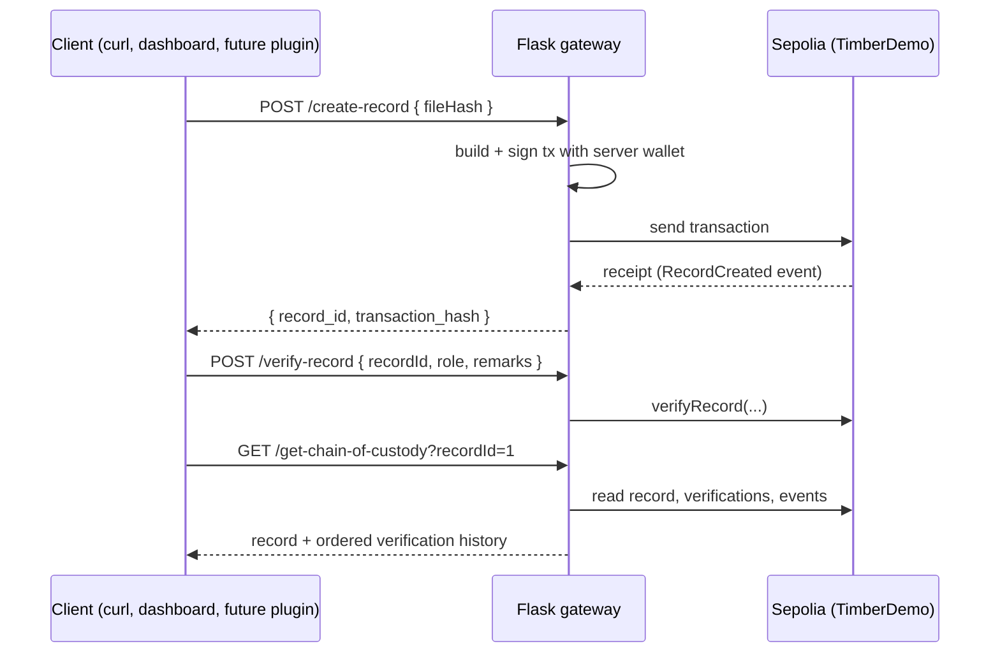

# PET Blockchain Backend

This folder contains the on-chain half of PET:

- **`TimberDemo` smart contract** (Solidity). Stores file hashes as records and lets supply-chain roles (`logger`, `trucker`, `processor`) add verifications that form a chain of custody.
- **Flask gateway** (Python). A small HTTP API that signs and sends contract transactions for its callers, plus a built-in chain-of-custody dashboard.
- **Deployment scripts** for an Ubuntu VM on Azure behind nginx with HTTPS.

> This folder keeps the backend's original repository name, **witec-demo**. DSL's reference deployment ran at `witec.io`, and that domain still appears in the config files. Replace it with your own domain.

**Status:** prototype, **Ethereum Sepolia testnet only**. The [PET plugin](../lingualinkledger/README.md) does not call this gateway yet. The gateway has **no authentication**. See [`SECURITY.md`](../SECURITY.md).

---

## How it works



The gateway holds **one private key** and signs every transaction itself. Callers don't need a wallet, but on-chain every record and verification appears to come from the gateway's address.

---

## Folder contents

```
witec-demo/
├── helpers/
│   ├── TimberDemo.sol       Smart contract
│   ├── deploy.js            Hardhat deploy script (writes deployment.json)
│   ├── hardhat.config.js    Hardhat config (Solidity 0.8.28, Sepolia network)
│   └── make_vm.sh           Azure CLI script: creates the VM and opens ports 80/443
├── gateway/
│   ├── server.py            Flask API + dashboard
│   ├── flask-app.service    systemd unit for the gateway
│   └── witec-demo-nginx     nginx reverse-proxy + HTTPS site config
├── env.sample               Template for .env
├── guide.sh                 Original setup notes (not a runnable script)
└── package.json             Hardhat dependencies
```

> **Note:** this folder is not yet a standard Hardhat project. The contract, deploy script, and config live in `helpers/`. Fixing the layout is on the cleanup list (`../CODE_CLEANUP.txt`).

---

## Requirements

| For | You need |
|---|---|
| Contract deploy (your machine) | Node.js and npm |
| Wallet | A Sepolia account's private key, funded with Sepolia test ETH from a faucet |
| RPC | An **Infura** Sepolia endpoint. The gateway derives Infura's gas-price API URL from it; other providers fall back to fixed gas values. |
| VM (reference setup) | Azure subscription, [Azure CLI](https://learn.microsoft.com/cli/azure/), `jq`, SSH client |
| HTTPS | A domain name you can point at the VM |
| Gateway | Python 3, Flask, **web3.py 7.x**, python-dotenv |

The private key is stored in plain text in `.env` on the server.

---

## Configuration

Copy `env.sample` to `.env` and fill in both values:

```properties
PRIVATE_KEY=<wallet private key>
SEPOLIA_RPC_URL=https://sepolia.infura.io/v3/<your-project-id>
```

`.env` is used by Hardhat (to deploy) and by the gateway (to sign transactions).

Two values are **hardcoded in `gateway/server.py`** and must be edited after you deploy:

```python
CONTRACT_ADDRESS = ""          # address printed by the deploy step
DEPLOYMENT_BLOCK = 8823000     # block the contract was deployed in
```

`DEPLOYMENT_BLOCK` is where the gateway starts searching for contract events in `/get-chain-of-custody`. Set it to your deployment's block number, which you can find on a Sepolia block explorer.

---

## Part 1: Deploy the contract (your machine)

Run from `witec-demo/`:

```bash
# 1. Install Hardhat (npm must be installed)
npm install

# 2. Initialize Hardhat
npx hardhat init

# 3. Replace hardhat.config.js with the one in the repo; add scripts/deploy.js

# 4. Create .env (see Configuration)
cp env.sample .env

# 5. Compile. This produces the ABI the gateway needs:
#    artifacts/contracts/TimberDemo.sol/TimberDemo.json
npx hardhat compile

# 6. Deploy to Sepolia. Prints the contract address and writes deployment.json
npx hardhat run scripts/deploy.js --network sepolia
```

Then:

1. Check the deployment on a Sepolia block explorer and note its deployment block.
2. Update `gateway/server.py` with the contract address (`CONTRACT_ADDRESS`) and `DEPLOYMENT_BLOCK`.

---

## Part 2: Run the gateway locally (optional, for testing)

`server.py` reads its environment variables before it loads `.env`, so start it with the variables already exported:

```bash
cd gateway
cp ../artifacts/contracts/TimberDemo.sol/TimberDemo.json .
pip3 install flask web3 python-dotenv
set -a; source ../.env; set +a
python3 server.py            # serves on http://localhost:5000
```

Check it with `curl http://localhost:5000/health`.

---

## Part 3: Deploy to an Azure VM (reference setup)

This recreates DSL's reference deployment: Ubuntu 22.04, `Standard_D2s_v3`, region `eastus2`, admin user `az`. **The VM costs money while it runs.**

### 3.1 Create the VM

From `witec-demo/`:

```bash
ssh-keygen -t rsa -b 4096 -f witec_vm     # make_vm.sh expects witec_vm.pub here
az login
./helpers/make_vm.sh                        # creates resource group "witec-demo", VM, opens 80/443; prints the IP
```

### 3.2 Install packages on the VM

```bash
ssh -i witec_vm az@<VM_IP>

sudo apt update && sudo apt upgrade -y
sudo apt install python3 python3-pip git curl nginx certbot python3-certbot-nginx -y
python3 --version
pip3 install flask web3 python-dotenv
mkdir ~/witec-demo && cd ~/witec-demo
```

The systemd unit expects the app in `/home/az/witec-demo`. If you change the user or folder, edit `flask-app.service` to match.

### 3.3 Copy files to the VM

From `witec-demo/` on your machine:

```bash
scp -i witec_vm gateway/server.py gateway/flask-app.service gateway/witec-demo-nginx \
    .env artifacts/contracts/TimberDemo.sol/TimberDemo.json \
    az@<VM_IP>:~/witec-demo/
```

### 3.4 Point your domain and get a certificate

1. Create a DNS **A record** for your domain pointing to the VM's IP. Visit `http://<your-domain>` and you should see the default nginx page.
2. On the VM, request an HTTPS certificate:

```bash
sudo nano /etc/nginx/sites-available/default   # change "server_name _;" to "server_name <your-domain>;"
sudo systemctl restart nginx
sudo certbot --nginx -d <your-domain>
sudo systemctl restart nginx
sudo nginx -t
```

### 3.5 Start the gateway as a service

```bash
sudo cp flask-app.service /etc/systemd/system/flask-app.service
sudo mkdir -p /var/log/flask-app
sudo chown az:az /var/log/flask-app
sudo systemctl daemon-reload
sudo systemctl enable flask-app
sudo systemctl start flask-app
```

The service loads `.env` itself, so the environment-variable workaround from Part 2 isn't needed here.

### 3.6 Put nginx in front of the gateway

First, **replace every `witec.io` in `witec-demo-nginx` with your domain**, including the certificate paths under `/etc/letsencrypt/live/`. Then:

```bash
sudo rm /etc/nginx/sites-enabled/default
sudo cp witec-demo-nginx /etc/nginx/sites-available/witec-demo
sudo ln -s /etc/nginx/sites-available/witec-demo /etc/nginx/sites-enabled/
sudo nginx -t
sudo systemctl restart nginx
```

nginx terminates HTTPS on port 443, redirects port 80 to HTTPS, and forwards requests to the gateway on `127.0.0.1:5000`.

### 3.7 Verify

```bash
curl https://<your-domain>/health
```

The dashboard is at `https://<your-domain>/dashboard`.

**Logs:**

```bash
journalctl -u flask-app -f
```

---

## Gateway API

All responses are JSON. The write endpoints wait until the transaction is mined before responding, which can take tens of seconds on Sepolia.

| Method | Path | Input | Returns |
|---|---|---|---|
| GET | `/health` | — | Connection status, latest block, gateway account, contract address, record count, ETH balance |
| GET | `/check-pending` | — | Latest vs. pending nonce, to spot stuck transactions |
| POST | `/create-record` | `{"fileHash": "0x<64 hex chars>"}` | `record_id`, `transaction_hash`, `gas_used` |
| POST | `/verify-record` | `{"recordId": 1, "role": "trucker", "remarks": "..."}` | `transaction_hash`, `gas_used` |
| POST | `/deactivate-record` | `{"recordId": 1}` | `transaction_hash`, `gas_used` |
| GET | `/get-record?recordId=1` | — | Hash, creator, created time, active flag |
| GET | `/get-verifications?recordId=1` | — | All verifications for the record |
| GET | `/get-chain-of-custody?recordId=1` | — | Record details + ordered verifications, with transaction hashes |
| GET | `/dashboard` | — | HTML dashboard of all records and their custody chain |

> **Hash format:** send `fileHash` as `0x` followed by 64 hex characters (a SHA-256). Without the `0x` prefix, the gateway treats the value as text and keeps only its first 32 characters.
>
> **Roles:** always pass `role`. The default is `inspector`, which the contract rejects.

**Gas:** each write uses a 300,000 gas limit. Fees are Infura's "high" suggestion × 1.3. If that lookup fails, the gateway falls back to 15 gwei max fee and 2 gwei priority fee.

### Example

```bash
curl -X POST https://<your-domain>/create-record \
  -H "Content-Type: application/json" \
  -d '{"fileHash": "0x<sha256 of your file>"}'
```

---

## Smart contract reference

`TimberDemo.sol` (Solidity ^0.8.28, MIT SPDX tag).

**Data**

- `Record`: `fileHash` (bytes32), `creator`, `createdAt`, `isActive`. IDs start at 1.
- `Verification`: `verifier`, `role`, `remarks`, `timestamp`, `isActive`. Stored per record, in order.
- `validRoles`: set in the constructor to `logger`, `trucker`, `processor`.

**Functions**

| Function | Type | Notes |
|---|---|---|
| `createRecord(bytes32 fileHash)` | write | Returns the new record ID |
| `verifyRecord(uint recordId, string role, string remarks)` | write | Record must exist, be active, and `role` must be valid |
| `deactivateRecord(uint recordId)` | write | **Any caller** can deactivate any record |
| `addValidRole(string role)` | write | **Any caller** can add a role (no access control yet) |
| `getRecord`, `getVerification`, `getVerificationCount`, `getAllVerifications` | view | Read helpers |

**Events:** `RecordCreated`, `RecordVerified`, `RecordDeactivated`. The gateway reads these to find transaction hashes for the chain of custody.

---

## Troubleshooting

- **`AttributeError: 'NoneType' object has no attribute 'split'` on startup:** the environment variables weren't set before `server.py` started. See [Part 2](#part-2-run-the-gateway-locally-optional-for-testing).
- **`FileNotFoundError: TimberDemo.json`:** copy the ABI from `artifacts/contracts/TimberDemo.sol/TimberDemo.json` into the same folder as `server.py`.
- **Write calls fail with a funds or gas error:** check the ETH balance in `/health`, then top up the wallet from a Sepolia faucet.
- **Transactions seem stuck:** `/check-pending` shows how many are pending for the gateway account.
- **Chain of custody shows no transaction hashes:** `DEPLOYMENT_BLOCK` is probably later than your actual deployment block.
